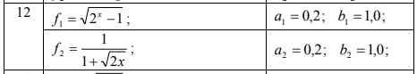

# Lab 5

## Part 1:
### Task:
Arrange in the form of functions (methods) the calculation of the integral
by the method of rectangles and trapezium (respectively, the prm and trp functions)
for each of the two functions. Take as formal parameters
integration limits, integrand name and precision
integral calculation.

Rectangle formula:  

Trapezium formula:  

### Solution:

[task 1.rb](task%201.rb)

---

## Part 2:
### Task:
Format the calculation of the sum as a method of the Ruby language row elements for a given function.
The sum of the elements of the series should be calculated:
1. For all values from the specified range of the x argument.
2. For any value of the number of elements of a series n from a given
   interval or the sum of an infinite series with an accuracy of ε= 0.001

### Solution:

[task 2.rb](task%202.rb)